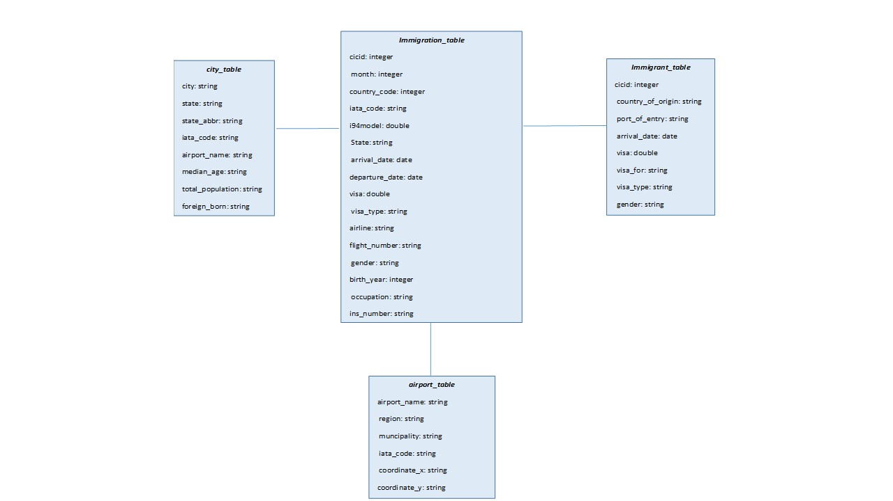

## Data Engineering Final Project

This project creates data lake for Immigration to USA during the year 2016.  Currently data
is residing on S3.  ETL pipeline is designed to extract data from S3, processing using Spark,
and loading back to S3 as set of tables.  These tables can be leveraged by Anayltics and Business 
Intelligence teams to find the US immigration patterns - visa type, country of origin, gender 
in context with US city/state demographics.

#### Datasets
        (1) Immigration data: SAS file for each month of 2016. 
            This data comes from US National Tourism and Trade Office, and the original
            source: https://travel.trade.gov/research/reports/i94/historical/2016.html 
            Following columns were extracted for each month of data.
            
                 |-- cicid: double (nullable = true)
                 |-- i94yr: double (nullable = true)
                 |-- i94cit: double (nullable = true)
                 |-- i94res: double (nullable = true)
                 |-- i94port: string (nullable = true)
                 |-- arrdate: date (nullable = true)
                 |-- i94mode: double (nullable = true)
                 |-- i94addr: string (nullable = true)
                 |-- depdate: date (nullable = true)
                 |-- i94bir: double (nullable = true)
                 |-- i94visa: double (nullable = true)
                 |-- count: double (nullable = true)
                 |-- dtadfile: string (nullable = true)
                 |-- visapost: string (nullable = true)
                 |-- occup: string (nullable = true)
                 |-- entdepa: string (nullable = true)
                 |-- entdepd: string (nullable = true)
                 |-- entdepu: string (nullable = true)
                 |-- matflag: string (nullable = true)
                 |-- biryear: double (nullable = true)
                 |-- dtaddto: string (nullable = true)
                 |-- gender: string (nullable = true)
                 |-- insnum: string (nullable = true)
                 |-- airline: string (nullable = true)
                 |-- admnum: double (nullable = true)
                 |-- fltno: string (nullable = true)
                 |-- visatype: string (nullable = true)

        (2) Airport Code: CSV file with table of airport codes and corresponding cities
            source: https://datahub.io/core/airport-codes#data
            
                 |-- ident: string (nullable = true)
                 |-- type: string (nullable = true)
                 |-- name: string (nullable = true)
                 |-- elevation_ft: string (nullable = true)
                 |-- continent: string (nullable = true)
                 |-- iso_country: string (nullable = true)
                 |-- iso_region: string (nullable = true)
                 |-- municipality: string (nullable = true)
                 |-- gps_code: string (nullable = true)
                 |-- iata_code: string (nullable = true)
                 |-- local_code: string (nullable = true)
                 |-- coordinates: string (nullable = true)
        
        (3) US City Demographic Data: CSV file with information on US City demographics:
            population -male, female, median income etc. 
            Source: https://public.opendatasoft.com/explore/dataset/us-cities-demographics/export/
            
                 |-- City: string (nullable = true)
                 |-- State: string (nullable = true)
                 |-- Median Age: string (nullable = true)
                 |-- Male Population: string (nullable = true)
                 |-- Female Population: string (nullable = true)
                 |-- Total Population: string (nullable = true)
                 |-- Number of Veterans: string (nullable = true)
                 |-- Foreign-born: string (nullable = true)
                 |-- Average Household Size: string (nullable = true)
                 |-- State Code: string (nullable = true)
                 |-- Race: string (nullable = true)
                 |-- Count: string (nullable = true)

        (4) IATA code: CSV file, lookup to get IATA code to airport name, city, state
            Source: https://www.airportcodes.us/us-airports.htm
            
                |-- Code: string (nullable = true)
                |-- Name: string (nullable = true)
                |-- City: string (nullable = true)
                |-- State: string (nullable = true)
     
        (5) Country Code: CSV file that's look up for Country Name based on I94CIT 3 digit value number
            Source: I94_SAS_Lables_Descriptions.SAS.
            
                |-- I94CIT: string (nullable = true)
                |-- Country: string (nullable = true)

#### Data Model

Star schema:  
"immigration_table" is a fact table with most relevant busienss data and 
"immigrant_table","airport_table", "city_table" are supporting dimension tables.

Immigration and airport Staging tables were created to get value from data sources and load in to tables appropriately.

Look up tables were created for linking IATA code (airport code) to add to the city table. 

Immigration table had only numeric code for the country, country code table was created based on I94 description to find the
country of origin for a immigrant table. 

#### Tables

    (1) Immigration Table - Created from the I94 SAS files.
        Fields:
    
         cicid: integer - unique ID for each immigrant used as PK for this table
         country_code: integer - I94CIT field from I94, country immigrating from e.g. 582 -> Mexico
         iata_code: string - Airport code e.g. BOS -> Boston, NYC - New York City
         i94model: double - mode of entry e.g. 1-> Air, 2-> Sea, 3-> Land
         State: string - Standard US state e.g. CA -> California, NY -> New York
         arrival_date: date - data of arrival YYYY-MM-DD
         departure_date: date - date of departure YYYY-MM-DD
         visa: double- visa code, e.g. 1 = Business, 2 = Pleasure
         visa_type: string visa type per visa code e.g. Business, Student
         airline: string - Airline used to arrive in US
         flight_number: string - Flight Number of airline used to arrive in US
         gender: string - Non immigrant sex e.g. M, F
         birth_year: integer - 4 digit year of birth
         occupation: string - occupation that will be performed in US
         ins_number: string - INS number
         admission_number: float - Admission number
         
    (2) Airport Table - Created from airport code csv file
        Fields:
        
        airport_name: string e.g. Abu Dhabi International Airport
        region: string - Region of the airport e.g AE-AZ
        muncipality: string - e.g. Abu Dhabi
        iata_code: string - 3-digit Airport code, e.g. ALV
        coordinate_x: string - can be used to find location airport
        coordinate_y: string  - can be used to find location airport
        
    (3) City Table - created from US city demographics csv file
        Fields:
          
         city: string - City for the airport e.g. San Francisco 
         state: string - State e.g California
         state_abbr: string - State abbr. e.g CA
         iata_code: string - 3-digit Airport code e.g. SFO
         airport_name: string e.g. San Francisco International Airport
         median_age: string - median age for the population in that city
         total_population: string - total population for this city
         foreign_born: string - how many are foreign born in that city
         
    (4) Immigrant Table - created from immigration table and looking up country of origin based on country code (I94CIT)
        Fields:
        
         cicid: integer - unique ID for immigrant based on I94 form
         country_of_origin: string - Immigrating from which country
         port_of_entry: string - what airport (city) as entry point e.g. NYC, ATL (iata code)
         arrival_date: date - date of arrival YYYY-MM-DD 
         visa: double - visa type e.g. 1.0, 2.0, 3.0
         visa_for: string - visa type description - Pleasure, Student, Business
         visa_type: string - category of visa type e.g. F1, B2
         gender: string - sex M, F, NA
         birth_year: integer - 4 digit birth year YYYY to calculate age
         occupation: string - occupation, mostly null as CIC not using it
         
Data quality checks were run to ensure the pipeline ran as expected.  Some of these checks were done in notebooks while
prototyping and testing. Most data quality checks, validation and corrections were done while creating spark dataframe and tables.

Further improvement, automation is definitely possible and desirable for data quality checks - if have more time to work on this.

Final goal was accomplished to process massive amount of I-94 records - all immigration arrival to USA in year 2016.
There were 12 SAS files, one for each month, (> 1 M lines). This project builds data lake that can be used by Anlytics
team to study immigration pattern by country of origin and possibly co-relate with US city demographics.
This would not have been possible from the raw data in different file formats such as SAS, CSV, Text, JSON.

#### Files
    (1) i94-SAS.py - Reads I94 SAS files, writes them to AWS S3 as parquet files.
    (2) immigration-etl.py - ETL pipeline script reads input from AWS S3, cleans the data
                             creates data lake tables and writes parquet file out to AWS S3. 
    (3) immigration_etl.ipynb, Test_SparkRead_I94SAS.ipynb - were used to develop, test, and prototype above scripts.
    (4) dl-config.cfg - AWS credentials and Input/Output data paths
                     

#### How to Run
    
     (1) Set up AWS EMR to run Spark job
     (2) Change dl_config.cfg to dl.cfg and add AWS credentials.
         (S3 buckets with input/output are not public access)
     (3) Run "python immigration-etl.py" 
     
     
#### References
    (1) https://spark-packages.org/package/saurfang/spark-sas7bdat
    (2) https://github.com/saurfang/spark-sas7bdat
    (3) https://github.com/jukkakansanaho/